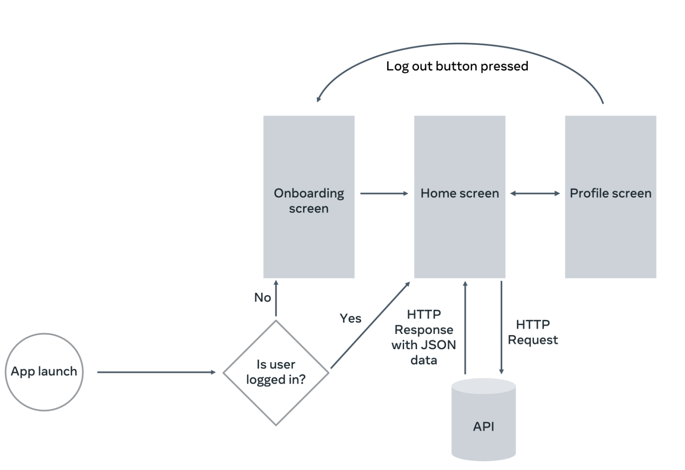

# Android Developer Capstone Little Lemon App 📱
Coursera Android App Capstone by META. The final project of [Meta Android Developer Professional Certificate](https://www.coursera.org/professional-certificates/meta-android-developer).

## Overview
This Android application is the final project of the Coursera Capstone by META. It's written in Kotlin and utilizes Jetpack Compose for building its UI.

## Application Flow

   <!-- 50% of 1646px -->

## Features
- Navigation: Navigate to different screens.
- Fetch remote data: Fetch remote data using Ktor.
- Store data locally: Store it in database using Room and sharedPreference.
- Theme: Use Theme to centralize styling.

## Requirements
Android SDK
Android Build Tools

## Wireframe Designs

   <!-- 50% of 439px -->

🔗 

## Screenshots
<table>
  <tr>
    <td></td>
    <td></td>
    <td></td>
  </tr>
</table>

